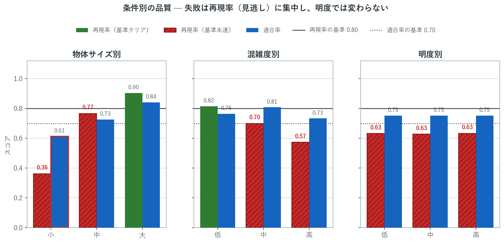
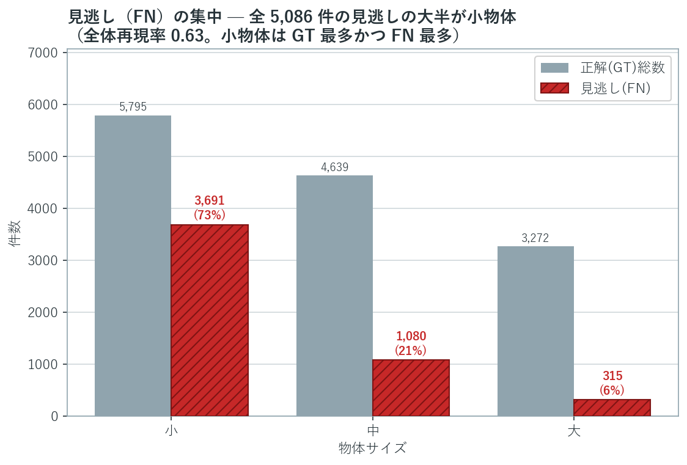
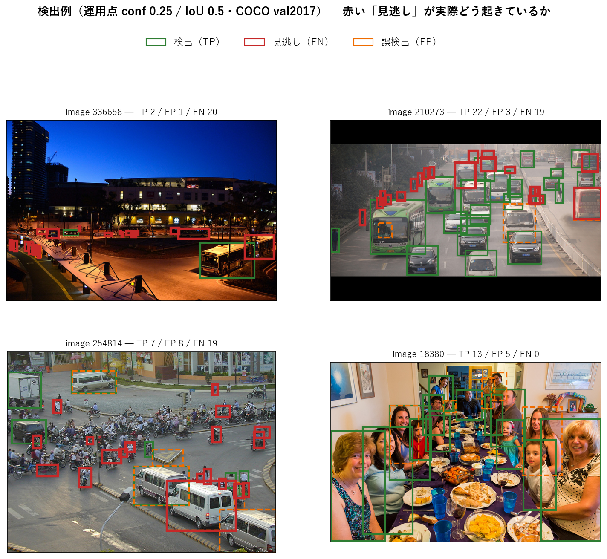
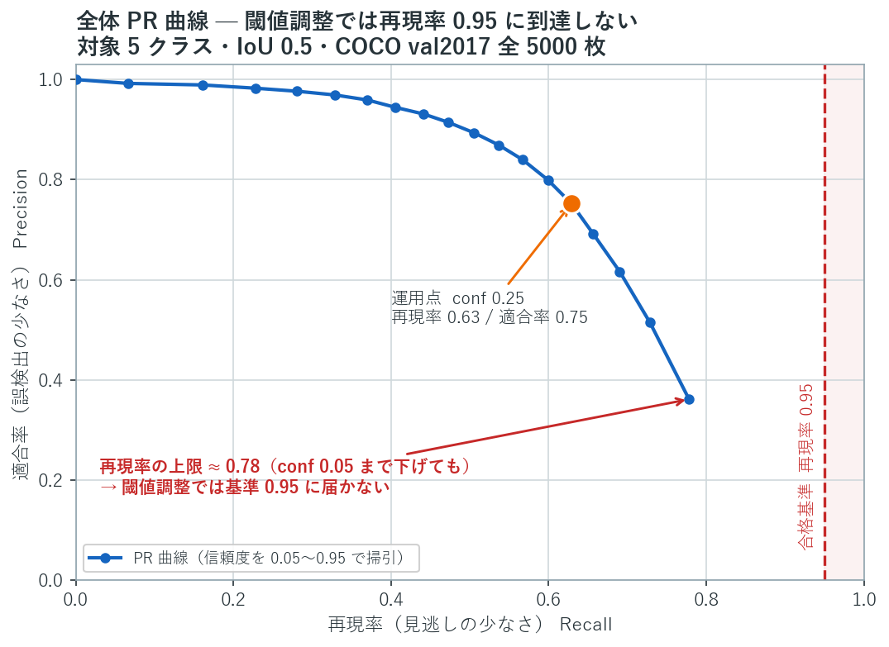

# 既存物体検出モデルの導入可否評価

[](https://github.com/nani9ashi/qa-portfolio-object-detection/actions/workflows/criteria-integrity.yml)

*QAポートフォリオ3部作の③（評価・判断編）。シリーズ全体は末尾「関連作品」を参照。*

調達候補の物体検出モデル（YOLOv8n・COCO 学習済み）を、歩行者・車両の**安全補助用途**で本番投入してよいか——この問いに答えるため、モデルには手を加えず**既製モデルの出力だけを外から評価**し、事前に固定した受け入れ基準に対する導入可否（Go / No-Go）を判断した QA プロジェクトです。

題材には原体験があります。引越トラックの助手席で、住宅街の狭い道を進む運転席の死角と、歩行者・自転車のヒヤリとする場面を日常的に見てきました。安全補助システムにとって「見逃し」がどれほど重い失敗か、体感として知っていることがこの評価の出発点です。

**結論は導入不可（No-Go）。** 全体の再現率 ≈ 0.63（合格基準 0.95）で大きく未達であり、失敗は「見逃し」に集中しています（適合率・位置精度・推論時間は基準を満たす）。

## 結論サマリ

| 観点 | 結果 |
|---|---|
| 総合判定 | **導入不可（No-Go）** |
| 全体 再現率 | 0.63（基準 0.95 ❌） |
| 全体 適合率 / 平均IoU | 0.75（基準 0.70 ✓）/ 0.85（基準 0.70 ✓） |
| 失敗の本質 | 「誤検出」でも「速度」でもなく **「検知漏れ（見逃し）」** に集中 |
| 条件別の傾向 | 物体が小さいほど・混雑するほど見逃しが増える（明度は主因ではない） |
| 推論時間 | 8.1 ms/フレーム（基準 100ms ✓、GPU） |

各ケースの算出値・合否・原因分析・次フェーズ提言は **[テスト完了レポート](docs/test-report.md)** にまとめています。**1つだけ読むならこれを推奨します。**

## 背景: なぜこの評価が必要か

物体検出は成熟技術であり、高品質な学習済みモデルが公開されている。自作より調達が合理的だが、**COCO 上の公称性能が、当社のこの用途でそのまま再現される保証はない**。とりわけ安全補助では、見逃し（実在する人・車を検出しない）が事故に直結する一方、誤検出も過剰な介入（不要な急制動など）という二次被害を生むため、「再現率さえ高ければ安全」という単純な図式は成り立たない。

だから「テストして合格を確認した」で終わらせず、事前に確定した合格基準に対して実態を測り、不合格なら不合格として、どの観点でどれだけ届かなかったかを根拠とともに示す——それがこの評価の仕事になる。背景・ユーザーストーリー・受け入れ条件は [評価依頼書](docs/evaluation-request.md)（PdM 視点）を参照。

## 評価の設計

### 何を測るか

評価データは COCO val2017 全 5,000 枚、対象クラスは person / bicycle / car / bus / truck。運用点（信頼度 conf 0.25・IoU 0.5）での全体評価に加え、**物体サイズ・混雑度・明度**のサブセットで条件別の劣化を捕捉する（AC-4）。評価ケースは EVAL-001〜008（[テスト設計書](docs/test-design.md)）。

### 何をもって合格とするか

合格基準（AC-1〜AC-5）はビジネス要件から導出し、GitHub Issue で PdM・QA・Dev の合意として固定した（**Issue [#1](https://github.com/nani9ashi/qa-portfolio-object-detection/issues/1)**: AC-1 再現率 / AC-3 適合率、**Issue [#2](https://github.com/nani9ashi/qa-portfolio-object-detection/issues/2)**: AC-2 位置精度 / AC-4 条件別劣化 / AC-5 推論時間）。設計上の要点は3つ。

- **独立2軸の AND 判定**: 再現率（見逃しの少なさ）と適合率（誤検出の少なさ）を F1 のような統合スコアに丸めず、それぞれ独立した合格条件として AND 判定する。統合は片方の劣化をもう片方で隠すため、安全用途では採らない（理由の全文は [test-plan](docs/test-plan.md) §2.4）。
- **合否と参考値の分離**: 合否を分ける指標（再現率・適合率・IoU・推論時間）と、解釈の補助に留める参考指標（mAP・クラス別・PR 曲線）を明確に区別する。
- **基準を実測前に固定し、後から緩めない**: 合格水準は `evaluation/config.py` に一元管理し、結果出力の前に「基準が改変されていないこと」「統合スコアが混入していないこと」を自動検証する（上部の Criteria Integrity バッジ）。実測値に合わせて基準を動かす操作はしない。

### 役割分担

| 役割 | 責務 |
|---|---|
| PdM | 事業要件（見逃し/誤検出の重み付け）の提示、合格水準の承認、導入可否の最終判断 |
| QA | 評価計画・設計・実装・実行、品質メトリクスの計測、結果の報告（本リポジトリの主担当） |
| Dev | モデルの調達・選定。評価結果を受けて次フェーズで関与（本評価では実行を伴わない） |

導入可否の最終決定は PdM が下し、QA はその判断材料を提供する。なお本プロジェクトは一人称のシミュレーションであり、PdM・Dev の発言や承認も自分が役割を演じて GitHub Issue 上に記録したもの（実在の第三者ではない）。それでも役割を分けているのは、導入可否の判断がもつ構造——**誰が基準を承認し、誰が測定し、誰が最終決定するか**——を実務と同じ形で残すためである。

## 結果: 失敗は「見逃し」に集中している

以下の図は `make_figures.py` が `results/` の成果物（各 EVAL の JSON・PR 曲線 CSV）から再生成したもの。数値も基準線も図側にハードコードしていないため、図と本文・判定の数値は乖離しない。



*条件別の品質。再現率（緑＝基準クリア／赤＝未達）が落ちる一方で適合率（青）はほぼ基準上に残り、失敗が「見逃し」に集中していることがわかる。物体サイズ・混雑度では単調に悪化する一方、明度では再現率がほぼ変わらない（約 0.63 で横ばい）＝明度は差を生む主因ではない。ただし水準自体は全明度帯で再現率の基準 0.80 に未達。*



*見逃し（FN）の内訳。全 5,086 件の見逃しのうち約 73%（3,691 件）が小物体に集中している。小物体は正解（GT）数でも最多（5,795 件）であり、全体再現率 0.63 を最も強く押し下げている。*

これらの数値が実際の画像でどう見えるかを検出例で示す。



*検出例（運用点 conf 0.25 / IoU 0.5）。緑=正しく検出（TP）、赤=見逃し（FN）、オレンジ=誤検出（FP）。対象クラスの見逃し件数が多い順に自動抽出した3枚＋対比のための良好例1枚。集計値ではなく「見逃しが実際どう見えるか」を示す例示であり、選定は決定的ルールによる。なお枠の付かない物体は本プロジェクトの対象外クラス（例：オートバイ）または COCO 未注釈の物体であり、誤検出の一部は実在するが未注釈の対象への検出である。GT の限界は次節を参照。*

## 判断とその限界

No-Go の判断は、独立2軸の AND 条件のうち再現率（AC-1）が大きく未達であることによる。ただしこの判断には適用範囲があり、以下の限界とセットで読む必要がある。

- **ドメイン差**: COCO の一般シーンと現場映像はドメインが異なり、本評価の結果が現場でそのまま再現する保証はない。現場での実地評価は範囲外。
- **GT の網羅性**: 本評価は COCO の注釈を GT とするが、COCO は全物体を網羅的に注釈してはいない（小さい・遠い・密集・曖昧な対象は未注釈のことがある）。加えて本プロジェクトでは対象を 5 クラスに限定し、iscrowd（密集を 1 領域にまとめた注釈）を除外している。したがって数値は「現実の全物体」ではなく「COCO 注釈」に対する再現率・適合率であり、とりわけ実在するが未注釈の対象をモデルが検出すると FP として数える。よって**測定された適合率は保守的な値**といえる（真値はこれ以上）。それでも適合率の基準にかかわらず再現率は基準 0.95 に遠く、No-Go の結論は変わらない。
- **クラススコープ**: 評価対象は person / bicycle / car / bus / truck の5クラスで、**motorcycle は対象外**（traffic light 等の非車両も対象外）。安全補助は二輪車も衝突回避の対象である以上、bicycle を含めつつ motorcycle を外す線引きは本用途には不足で、(1) 現場に多い二輪が評価上は無視され、(2) **motorcycle の検出品質について本評価は何も言えない**（カバレッジの穴）。したがって No-Go は「対象5クラスに対する」判断であり、二輪を含む完全な可否判断には motorcycle を加えた再評価が要る（作業項目は [テスト完了レポート §7.4](docs/test-report.md#74-次フェーズ作業項目バックログ) 参照）。

### 次フェーズ

見逃しの底上げは信頼度閾値の調整だけでは不十分で、下の PR 曲線のとおり再現率は頭打ちになる。推論時間に大きな余裕があるため、より大きいモデル（YOLOv8m/l 等）への変更を AC-5 込みで再評価するのが有望。



*全体 PR 曲線（運用点 conf 0.25）。信頼度を 0.05 まで下げても再現率は約 0.78 で頭打ちになり、その時点で適合率は 0.36 まで悪化する。再現率 0.95 は信頼度調整では到達できず、見逃しの底上げにはモデル変更が要ることを示す（次フェーズの論拠）。*

次フェーズの作業項目（モデル変更・motorcycle 追加・クラス別基準 等）の一覧と優先度・追跡は、[テスト完了レポート §7.4](docs/test-report.md#74-次フェーズ作業項目バックログ) と GitHub Issues にまとめている。

## 再現方法

YOLO の推論は決定的なため、GPU 環境（CUDA 対応 PyTorch）で 1 回実行すれば再現できる（同一データ・同一モデル・同一運用点なら結果は一致）。評価本体は次の 1 コマンドで、COCO val2017 取得 → 推論 → EVAL-001〜008 → 総合判定までを実行し、`results/` に各 EVAL の JSON・PR 曲線 CSV・`summary.json` を出力する。

```bash
python evaluation/run_eval.py --num-images 5000 --device cuda
```

環境構築（CUDA 版 PyTorch の導入）、依存関係、README 用の図の再生成、整合性チェックの実行は [SETUP.md](SETUP.md) に集約している。

## リポジトリ構成とドキュメント

```
qa-portfolio-object-detection/
├── docs/
│   ├── images/                 # README 用の図（make_figures.py が results/ から生成）
│   ├── evaluation-request.md   # 評価依頼書（PdM 視点・受け入れ条件 AC-1〜5）
│   ├── test-plan.md            # テスト計画書（合格水準・AND 判定方針）
│   ├── test-design.md          # テスト設計書（評価観点・評価ケース EVAL-001〜008）
│   └── test-report.md          # テスト完了レポート（結果・No-Go 判定・次フェーズ提言）
├── evaluation/                 # 評価フレームワーク（推論＋指標算出）
│   ├── run_eval.py             #   単一エントリ（データ取得→推論→全EVAL→判定）
│   ├── config.py               #   対象クラス・合格水準（緩めない唯一の置き場）
│   ├── core/                   #   データ/GT/推論/キャッシュ/マッチング/指標
│   └── cases/                  #   EVAL-001〜008（各ケースの算出ロジック）
├── results/                    # 評価結果（各 EVAL の JSON・PR曲線 CSV・summary.json）
├── make_figures.py             # results/ から README 用の図①②③を再生成（数値・基準線も results 由来）
├── make_overlays.py            # 検出例オーバーレイ図④を生成（evaluation/core の推論・マッチングを再利用）
├── requirements.txt
└── .gitignore
```

| ファイル | 内容 | 想定読者 |
|---|---|---|
| [evaluation-request.md](docs/evaluation-request.md) | 評価依頼書（背景・ユーザーストーリー・受け入れ条件 AC-1〜5） | PdM・QA |
| [test-plan.md](docs/test-plan.md) | テスト計画書（合格水準・AND 判定方針） | QA・マネージャー |
| [test-design.md](docs/test-design.md) | テスト設計書（評価観点・評価ケース EVAL-001〜008） | QA・開発者 |
| ★ [test-report.md](docs/test-report.md) | テスト完了レポート（結果・No-Go 判定・原因分析・次フェーズ提言） | マネージャー・採用担当者・QA |

## 関連作品（QAポートフォリオ3部作）

「品質保証で何を担うか」——作り込む・設計する・判断する——を段階的に広げた 3 部作の③です。

- **[① 技術・基礎編：チケット管理システム](https://github.com/nani9ashi/qa-portfolio-ticket-system)** — 期待値を厳密に書き下せる決定的な業務システムを対象に、JSTQB 準拠のプロセスとテストピラミッド（手動・API・E2E）で品質を作り込む。
- **[② 戦略・AI 編：AI学習レコメンド機能](https://github.com/nani9ashi/qa-portfolio-ai-recommender)** — 確率的に揺らぐ生成 AI プロダクトを対象に、テストを 2 層で設計し、判定 AI（測定器）自体の正しさまで人手正解との照合で検証する。
- **本リポジトリ｜③ 評価・判断編** — 自分で作っていない調達候補モデルを外から評価し、事前に固定した基準に対して導入可否（結論は No-Go）を判断する。

3 作を貫く主題は「**物差し（期待値・判定器・受け入れ基準）そのものは正しいか**」という問いです。

## 作者

**仁後慎太郎**（[GitHub](https://github.com/nani9ashi)）

施設警備・個別指導塾・引越の現場で「使う側」として品質の不全を体験したことを出発点に、品質保証を主題として作品を作っています。JSTQB Foundation Level 保有。哲学のバックグラウンドから、**「受け入れ基準＝物差しそのものは正しいか」を問い直す**ことを QA の軸にしています。

<!-- ポートフォリオサイト公開後: 全作品を束ねるサイトへのリンクをここに追加 -->

## ライセンス

本プロジェクトは MITライセンス に基づいて公開されています。利用条件については [LICENSE](LICENSE) ファイルをご参照ください。
